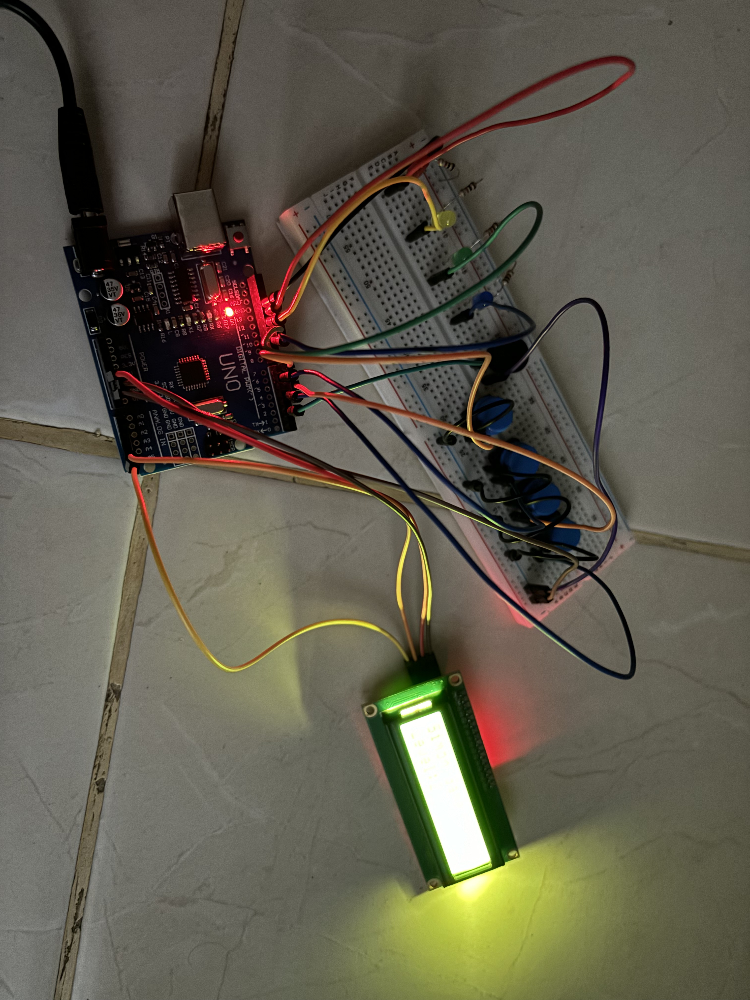

# Simon Game

The Simon game is a classic electronic memory game that challenges players to repeat a sequence of colored lights and corresponding sounds. The game consists of a series of buttons, each associated with a unique color and sound.

# Table of Contents

- [Features](#features)
- [Materials](#materials)
- [Circuit Diagram](#circuit-diagram)
- [Image](#image)
- [Demo](#demo)

# Features

- Four colorful buttons with corresponding LEDs

- Buzzer for audio feedback

- Randomly generated light and sound patterns

- 4 Score Tracking

# Materials

- 4 Active Buttons

- Buzzer 5V

- 4 Resistors 220 ohm

- 4 Leds

- lcd 16x2 with I2C Module

- Jumper cable

- Arduino Uno R3

# Circuit Design

Access design from this [link](https://www.tinkercad.com/things/hIxgxUKG1iI-simon-game-basic?sharecode=MWbiHiFtxk3cC9_Nde7Ek6cXGuo25MIQkeIMmH2ET5Q)

# Image

# Demo

Demo [link](https://drive.google.com/file/d/1gtiXjlFGf4p_C2K-BsZ6yv93PMYVUjo1/view?usp=sharing)
